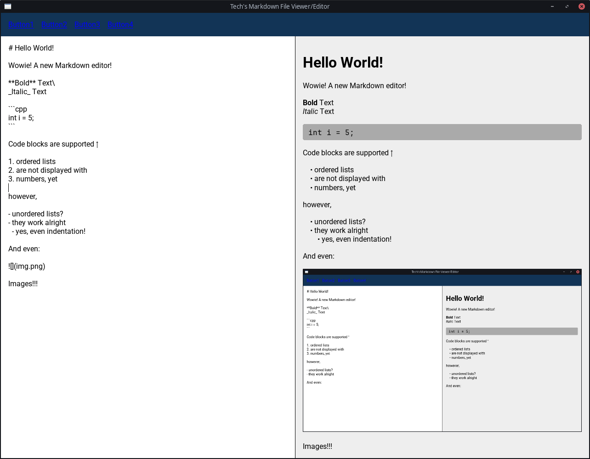

# Tech's Markdown File Editor

This will be an editor for Markdown _files_.
Not Projects.

I want to be able to simple double-click a Markdown file and have it open instantly.

Hence, this program tries to be as fast as possible.

It does this by _not_ shipping an entire web browser to render the Markdown,
but instead it converts the Markdown to HTML,
and then uses the amazing RmlUi library for rendering the HTML!

## Running

1. Clone recursively
2. `cmake -S . -B build -G Ninja`
3. `cmake --build build --parallel`

## Motivation

I tried many Markdown file editors, but none worked very well.

I started keeping a list here: https://gist.github.com/TechnicJelle/9d8e88b90e0834acbfe0938a909228bd
